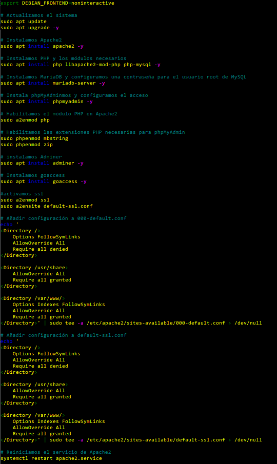
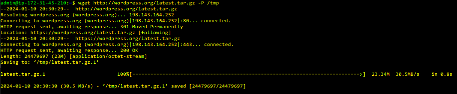
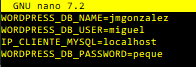
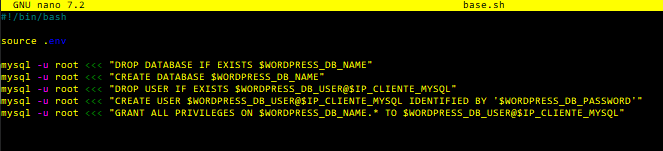
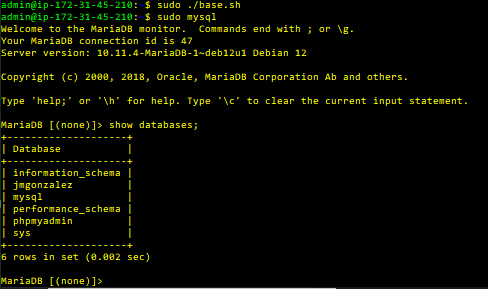
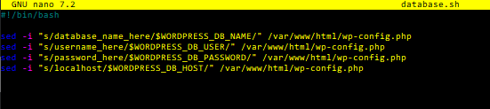
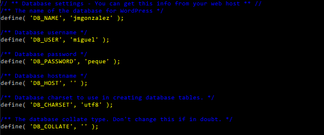
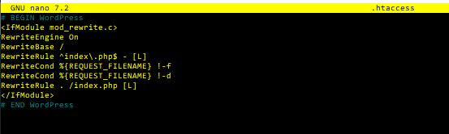
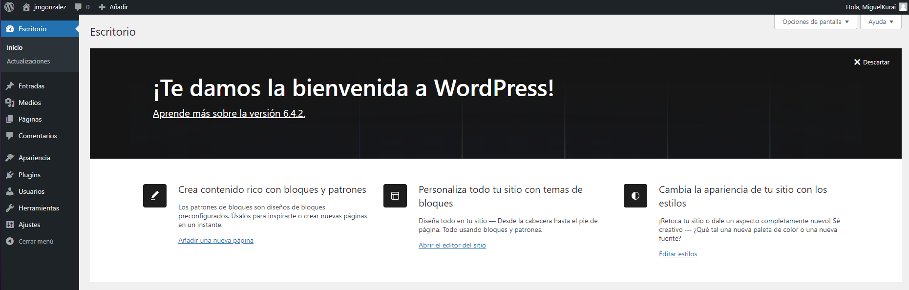

# WordPress

## Pasos a seguir

Para la instalación de WordPress, seguiremos estos pasos:

1. Instalación de la pila

Ejecutaremos un script para instalar la pila con todos los paquetes necesarios para el correcto funcionamiento de nuestro servidor WordPress

2. Descargar WordPress

Ahora descargamos el paquete WordPress en nuestro servidor

3. Fichero .env

Creamos un fichero .env para instroducir los valores de nuestra base de datos

4. Ejecutar .env

Ejecutamos los valores del archivo .env para crear una base de datos

Ahora comprobamos que se ha creado

Aprovechamos los mismos valores para nuestra database

Vemos cómo se ha editado el fichero de la base de datos

5. .htaccess

Ahora editamos el fichero .htaccess para introducir lo siguiente

6. Resultado

Por último, ya podemos acceder a nuestro servidor WordPress

